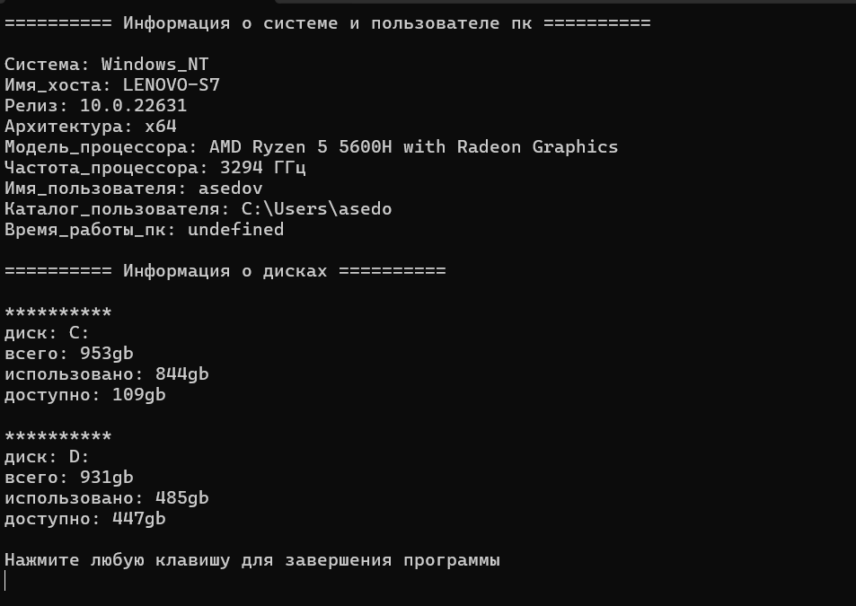

View system information using nodejs and packaging project in .exe file
> [!NOTE]
> To start the project you need to run command "node init -y" and "node install"
After that "node index.js"

> [!TIP]
> for packaging in .exe need use pkg app.js

## Example for windows

